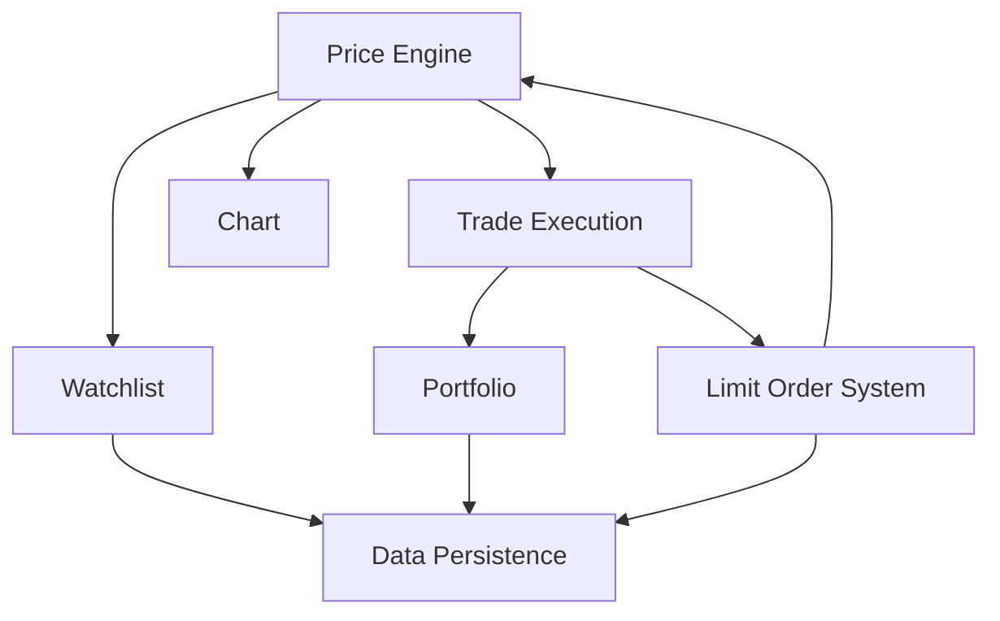

# Product Requirements Document (PRD)
## TradePulse - Simulated Paper Trading Terminal

**Version:** 1.1  
**Date:** February 15, 2026  
**Author:** Product Management  
**Status:** Reviewed & Refined  

---

## Table of Contents
1. [Executive Summary](#1-executive-summary)
2. [Product Vision & Goals](#2-product-vision--goals)
3. [Target Users & Personas](#3-target-users--personas)
4. [Problem Statement](#4-problem-statement)
5. [Functional Requirements](#5-functional-requirements)
6. [Non-Functional Requirements](#6-non-functional-requirements)
7. [Success Metrics & KPIs](#7-success-metrics--kpis)
8. [Constraints & Assumptions](#8-constraints--assumptions)
9. [Scope Definition](#9-scope-definition)
10. [Feature Prioritization (MoSCoW)](#10-feature-prioritization-moscow)
11. [Dependencies](#11-dependencies)
12. [Risks & Mitigations](#12-risks--mitigations)
13. [PRD Review Addendum](#13-prd-review-addendum)

---

## 1. Executive Summary

### Overview
TradePulse is a simulated paper trading terminal designed to provide an educational, risk-free environment for users to learn trading concepts and practice investment strategies. The platform uses mock price data to simulate real-world trading scenarios without any financial risk.

### Purpose
This PRD outlines the requirements for building a client-side web application that enables users to:
- Experience realistic trading mechanics without real money
- Learn fundamental trading concepts (market orders, limit orders, portfolio management)
- Visualize price movements through interactive charts
- Track and analyze simulated portfolio performance

### Technology Stack
- **Frontend Framework:** React with TypeScript
- **Charting:** Native SVG (no external charting libraries)
- **Data Persistence:** localStorage (browser-based)
- **Price Data:** Mock price engine (algorithmic simulation)

### Key Differentiators
- Zero financial risk learning environment
- Lightweight, client-side only architecture
- No external API dependencies
- Educational focus with realistic trading mechanics

---

## 2. Product Vision & Goals

### Vision Statement
*"To democratize trading education by providing an accessible, risk-free simulation platform that empowers aspiring traders to build confidence and competence before entering real markets."*

### Strategic Goals

| Goal | Description | Success Indicator |
|------|-------------|-------------------|
| **G1: Accessibility** | Create a barrier-free entry point for learning trading | Zero setup required; works in any modern browser |
| **G2: Realism** | Simulate realistic market behavior and trading mechanics | User feedback rating ≥4/5 on "realistic experience" |
| **G3: Education** | Foster understanding of trading concepts through practice | Users demonstrate concept mastery through trading patterns |
| **G4: Engagement** | Build habits through compelling user experience | Daily active usage; return user rate >40% |

### Business Objectives
1. **Short-term (0-3 months):** Launch MVP with core trading functionality
2. **Medium-term (3-6 months):** Gather user feedback and iterate on UX
3. **Long-term (6-12 months):** Establish as go-to platform for trading education

### Product Principles
1. **Simplicity First:** Complex features should not compromise ease of use
2. **Learn by Doing:** Prioritize interactive experiences over passive content
3. **Transparent Mechanics:** Users should understand how the system works
4. **Privacy by Design:** All data stays local; no tracking or external data sharing

---

## 3. Target Users & Personas

### Primary Personas

#### Persona 1: The Aspiring Investor - "Alex"
| Attribute | Details |
|-----------|---------|
| **Age** | 22-35 |
| **Background** | Recent graduate or early-career professional |
| **Tech Savviness** | High (comfortable with web applications) |
| **Trading Experience** | Novice (< 6 months or none) |
| **Goals** | Learn trading basics before investing real money |
| **Pain Points** | Fear of losing money; overwhelmed by complex trading platforms |
| **Usage Pattern** | 15-30 min sessions, 3-4 times per week |

> *"I want to try trading but I'm scared of losing my savings. I need a safe place to practice and understand how the market works."*

#### Persona 2: The Finance Student - "Jordan"
| Attribute | Details |
|-----------|---------|
| **Age** | 18-24 |
| **Background** | Finance/Economics student |
| **Tech Savviness** | Medium-High |
| **Trading Experience** | Theoretical knowledge, minimal practical |
| **Goals** | Apply classroom concepts in practice; build portfolio for internships |
| **Pain Points** | Gap between theory and practice; no safe testing environment |
| **Usage Pattern** | Intensive use during semester projects |

> *"My professor talks about limit orders and stop losses, but I've never actually placed one. I need hands-on practice."*

#### Persona 3: The Coding Bootcamp Graduate - "Sam"
| Attribute | Details |
|-----------|---------|
| **Age** | 25-40 |
| **Background** | Career transitioner into tech |
| **Tech Savviness** | Very High |
| **Trading Experience** | Varies |
| **Goals** | Study trading platform architecture; understand FinTech domain |
| **Pain Points** | Understanding financial domain while learning technology |
| **Usage Pattern** | Project-based deep dives |

> *"I'm building my portfolio with FinTech projects. This helps me understand how trading platforms work under the hood."*

### Secondary Personas
- **Educators:** Use platform for classroom demonstrations
- **Product Designers:** Study trading UI/UX patterns
- **Developers:** Reference implementation for learning

### Anti-Personas (Not Target Users)
- Professional day traders seeking real execution
- Users requiring real-time market data
- Institutional investors
- Users needing regulatory compliance features

---

## 4. Problem Statement

### Core Problems

#### Problem 1: Fear of Financial Loss
| Aspect | Details |
|--------|---------|
| **Problem** | New investors are paralyzed by fear of losing real money |
| **Impact** | Delayed financial literacy; missed investment opportunities |
| **Current Solutions** | Real paper trading accounts (complex setup); demo accounts (still intimidating) |
| **TradePulse Solution** | Zero-stakes environment with no real money connection whatsoever |

#### Problem 2: Complexity Barrier
| Aspect | Details |
|--------|---------|
| **Problem** | Professional trading platforms are overwhelming for beginners |
| **Impact** | Users give up before learning core concepts |
| **Current Solutions** | Simplified investing apps (too simplified; no learning) |
| **TradePulse Solution** | Progressive disclosure; essential features with clear mechanics |

#### Problem 3: Theory-Practice Gap
| Aspect | Details |
|--------|---------|
| **Problem** | Theoretical knowledge doesn't translate to practical trading skills |
| **Impact** | Students struggle in real-world financial careers |
| **Current Solutions** | Case studies; simulations with steep learning curves |
| **TradePulse Solution** | Learn-by-doing with immediate feedback and visualization |

#### Problem 4: Costly Real Trading Fees
| Aspect | Details |
|--------|---------|
| **Problem** | Experimenting with trading strategies incurs real costs |
| **Impact** | Users can't test strategies without financial consequences |
| **Current Solutions** | Limited free tiers; commission-free apps (still real money at risk) |
| **TradePulse Solution** | Unlimited practice trades with zero cost implications |

### User Story Framework
```
As a [persona],
I want to [action],
So that I can [outcome].
```

**Key User Stories:**
1. As an aspiring investor, I want to practice buying stocks with fake money, so that I can build confidence before using real funds.
2. As a finance student, I want to execute limit orders, so that I can understand order execution mechanics.
3. As a learner, I want to see my portfolio performance over time, so that I can evaluate my trading decisions.
4. As a user, I want my data to persist between sessions, so that I can track long-term progress.

---

## 5. Functional Requirements

### 5.1 Mock Price Engine

#### Overview
A deterministic yet realistic price simulation engine that generates synthetic market data for display and trading.

#### Requirements

| ID | Requirement | Priority | Acceptance Criteria |
|----|-------------|----------|---------------------|
| **MPE-001** | Generate realistic price movements | Must Have | Prices follow random walk with drift; no unrealistic jumps (>10% in single tick) |
| **MPE-002** | Support user-configurable update frequency | Must Have | Default 1-second intervals; **user-configurable in Settings UI** between 500ms-5000ms |
| **MPE-003** | Maintain price history for charting | Must Have | Store minimum 500 data points per symbol; **display rolling window of 200 points** |
| **MPE-004** | Provide bid/ask spread simulation | Should Have | Spread of 0.01%-0.05% based on "liquidity" |
| **MPE-005** | Support multiple symbols (15-20) | Must Have | **15-20 fictional stock symbols** available across diverse sectors |
| **MPE-006** | Generate volume data | Could Have | Simulated volume correlates with price volatility |
| **MPE-007** | Simulate market hours/sessions | Could Have | Optional trading session mechanics |

#### Technical Specifications
```typescript
interface PriceData {
  symbol: string;
  price: number;
  previousClose: number;
  change: number;
  changePercent: number;
  bid: number;
  ask: number;
  volume: number;
  timestamp: number;
}

interface PriceEngineConfig {
  updateIntervalMs: number;      // Default: 1000
  volatilityFactor: number;      // Default: 0.02 (2%)
  driftFactor: number;           // Default: 0.0001
  symbols: string[];
}
```

#### Behavior Rules
1. Prices must never go negative
2. Maximum single-tick movement: ±5%
3. Price precision: 2 decimal places for prices >$1; 4 decimal places for penny stocks
4. Historical data retained for current session only (cleared on page refresh unless persisted)

---

### 5.2 Watchlist

#### Overview
User-curated list of symbols for quick monitoring and trading access.

#### Requirements

| ID | Requirement | Priority | Acceptance Criteria |
|----|-------------|----------|---------------------|
| **WL-001** | Add symbols to watchlist | Must Have | User can add any available symbol via search/select |
| **WL-002** | Remove symbols from watchlist | Must Have | One-click removal with confirmation |
| **WL-003** | Display real-time price updates | Must Have | Prices update on each price engine tick |
| **WL-004** | Show price change indicators | Must Have | Green for positive, red for negative, with % change |
| **WL-005** | Persist watchlist across sessions | Must Have | Watchlist restored on return visit |
| **WL-006** | Reorder watchlist items | Should Have | Drag-and-drop or move up/down controls |
| **WL-007** | Quick trade from watchlist | Should Have | "Buy" / "Sell" buttons inline |
| **WL-008** | Limit watchlist size | Must Have | Maximum 20 symbols per user |

#### UI Components
- Symbol ticker (e.g., "ACME")
- Current price
- Change (absolute and percentage)
- Mini sparkline (optional, Could Have)
- Quick action buttons

---

### 5.3 Chart Visualization

#### Overview
Interactive SVG-based charting for price visualization and technical analysis.

#### Requirements

| ID | Requirement | Priority | Acceptance Criteria |
|----|-------------|----------|---------------------|
| **CV-001** | Display line chart of price history | Must Have | Smooth line connecting price points; **rolling window of 200 data points** |
| **CV-002** | Support multiple timeframes | Must Have | 1m, 5m, 15m, 1h, 4h, 1D views |
| **CV-003** | Auto-scale Y-axis | Must Have | Y-axis adjusts to visible data range with padding |
| **CV-004** | Display current price indicator | Must Have | Horizontal line showing live price |
| **CV-005** | Show crosshair on hover | Should Have | Vertical + horizontal lines with price/time tooltips |
| **CV-006** | Implement candlestick chart | Should Have | OHLC visualization as alternative to line |
| **CV-007** | Support pan and zoom | Should Have | Mouse drag to pan; scroll to zoom |
| **CV-008** | Display volume bars | Could Have | Volume histogram below price chart |
| **CV-009** | Add technical indicators (SMA/EMA) | Could Have | Moving average overlays |
| **CV-010** | Responsive chart sizing | Must Have | Chart adapts to container width/height |

#### Technical Specifications
```typescript
interface ChartConfig {
  type: 'line' | 'candlestick';
  timeframe: '1m' | '5m' | '15m' | '1h' | '4h' | '1D';
  showVolume: boolean;
  showCrosshair: boolean;
  indicators: Indicator[];
}

interface DataPoint {
  timestamp: number;
  open: number;
  high: number;
  low: number;
  close: number;
  volume: number;
}
```

#### SVG Implementation Guidelines
- Use `<path>` for line charts
- Use `<rect>` elements for candlesticks
- Implement viewBox for responsive scaling
- Use CSS transitions for smooth updates
- Optimize re-renders (only update changed elements)

---

### 5.4 Trade Execution

#### Overview
Market order execution for immediate buy/sell transactions.

#### Requirements

| ID | Requirement | Priority | Acceptance Criteria |
|----|-------------|----------|---------------------|
| **TE-001** | Execute market buy orders | Must Have | Buy X shares at current ask price |
| **TE-002** | Execute market sell orders | Must Have | Sell X shares at current bid price |
| **TE-003** | Display order confirmation | Must Have | **Mandatory blocking confirmation dialog** before execution; show order details |
| **TE-004** | Apply simulated slippage | Should Have | ±0.1% price variation to simulate real execution |
| **TE-005** | Validate sufficient funds | Must Have | Reject buy orders exceeding available cash |
| **TE-006** | Validate sufficient shares | Must Have | Reject sell orders exceeding held shares |
| **TE-007** | Record trade history | Must Have | Store all executed trades with timestamps |
| **TE-008** | Calculate trade costs | Must Have | Display total cost/proceeds before confirmation |
| **TE-009** | Support fractional shares | Could Have | Allow 0.001 share increments |
| **TE-010** | Provide execution feedback | Must Have | Success/failure notification with details |
| **TE-011** | Implement trade throttling | Must Have | **1-second cooldown** between trade executions to prevent accidental rapid-fire trades |

#### Trade Workflow
1. User selects symbol
2. User enters quantity
3. User selects Buy/Sell
4. System displays order preview (price, total, fees)
5. User confirms order
6. System validates (funds/shares)
7. System executes at simulated market price
8. System updates portfolio
9. System displays confirmation

#### Data Structures
```typescript
interface Trade {
  id: string;
  symbol: string;
  type: 'BUY' | 'SELL';
  orderType: 'MARKET' | 'LIMIT';
  quantity: number;
  price: number;
  total: number;
  status: 'PENDING' | 'EXECUTED' | 'CANCELLED' | 'REJECTED';
  timestamp: number;
  executedAt?: number;
}
```

---

### 5.5 Limit Orders

#### Overview
Price-conditional orders that execute when market price reaches specified threshold.

#### Requirements

| ID | Requirement | Priority | Acceptance Criteria |
|----|-------------|----------|---------------------|
| **LO-001** | Place limit buy orders | Must Have | Buy when price drops to/below limit |
| **LO-002** | Place limit sell orders | Must Have | Sell when price rises to/above limit |
| **LO-003** | Display open orders | Must Have | List all pending limit orders |
| **LO-004** | Cancel pending orders | Must Have | User can cancel any open order |
| **LO-005** | Modify pending orders | Should Have | Edit price or quantity of open orders |
| **LO-006** | Auto-execute on price match | Must Have | Orders trigger within price engine cycle |
| **LO-007** | Partial fills | Could Have | Allow partial execution based on "volume" |
| **LO-008** | Order persistence (GTC) | Must Have | **Limit orders persist indefinitely** (Good-Til-Cancelled); survive browser refresh |
| **LO-009** | Order type validation | Must Have | Reject illogical orders (buy limit above market) |
| **LO-010** | Fill notification | Must Have | **Visual toast notification** when limit order executes |
| **LO-011** | Concurrent order handling | Must Have | When multiple limit orders trigger simultaneously, **execute in FIFO order** (oldest first) |

#### Limit Order Logic
```
BUY LIMIT:
  - Limit price must be at or below current market price
  - Executes when ask price ≤ limit price

SELL LIMIT:
  - Limit price must be at or above current market price
  - Executes when bid price ≥ limit price
```

---

### 5.6 Portfolio Management

#### Overview
Comprehensive view of user's holdings, performance, and account status.

#### Requirements

| ID | Requirement | Priority | Acceptance Criteria |
|----|-------------|----------|---------------------|
| **PM-001** | Display portfolio summary | Must Have | Total value, cash, invested, P&L |
| **PM-002** | List all positions | Must Have | Show each holding with current value |
| **PM-003** | Calculate unrealized P&L | Must Have | (Current price - avg cost) × shares; **use Weighted Average Cost (WAC) method** |
| **PM-004** | Calculate realized P&L | Must Have | Sum of closed position gains/losses |
| **PM-005** | Show position details | Must Have | Avg cost (WAC), shares, current price, % change |
| **PM-006** | Display portfolio allocation | Should Have | Pie/bar chart of holdings by value |
| **PM-007** | Track portfolio history | Should Have | Portfolio value over time chart |
| **PM-008** | Set initial cash balance | Must Have | **$100,000 default; user-configurable** in settings (range: $1,000 - $10,000,000) |
| **PM-009** | Reset portfolio option | Must Have | Clear all positions and reset to initial cash |
| **PM-010** | Export portfolio data | Could Have | CSV download of positions and trades |

#### Portfolio Calculations
```typescript
interface Portfolio {
  cash: number;
  positions: Position[];
  totalValue: number;          // cash + sum of position values
  totalCost: number;           // sum of position costs
  unrealizedPL: number;        // totalValue - totalCost - cash
  realizedPL: number;          // sum of closed trade P&L
  dayPL: number;               // change since session start
}

interface Position {
  symbol: string;
  shares: number;
  avgCost: number;
  currentPrice: number;
  marketValue: number;         // shares × currentPrice
  costBasis: number;           // shares × avgCost
  unrealizedPL: number;        // marketValue - costBasis
  unrealizedPLPercent: number; // unrealizedPL / costBasis × 100
}
```

---

### 5.7 Data Persistence

#### Overview
Browser-based storage for user data across sessions.

#### Requirements

| ID | Requirement | Priority | Acceptance Criteria |
|----|-------------|----------|---------------------|
| **DP-001** | Persist portfolio state | Must Have | Positions and cash survive browser refresh |
| **DP-002** | Persist watchlist | Must Have | Watchlist restored on return |
| **DP-003** | Persist trade history | Must Have | Store trades; **FIFO pruning at 1000 trades** to manage storage |
| **DP-004** | Persist user preferences | Should Have | Theme, chart settings, price update interval, initial balance, etc. |
| **DP-005** | Handle storage limits | Must Have | Graceful degradation at quota (~5MB); **show warning banner but allow continued use** |
| **DP-006** | Data migration for schema changes | Should Have | Handle app updates without data loss |
| **DP-007** | Manual data export | Could Have | JSON download of all user data |
| **DP-008** | Manual data import | Could Have | Restore from exported JSON |
| **DP-009** | Clear all data option | Must Have | Factory reset functionality |
| **DP-010** | Storage error handling | Must Have | Notify user of storage failures |

#### Storage Schema
```typescript
interface StoredData {
  version: string;                // Schema version for migrations
  portfolio: Portfolio;
  watchlist: string[];
  trades: Trade[];
  openOrders: Trade[];
  preferences: UserPreferences;
  lastUpdated: number;
}
```

#### localStorage Keys
| Key | Description | Max Size |
|-----|-------------|----------|
| `tradepulse_portfolio` | Portfolio and positions | ~50KB |
| `tradepulse_watchlist` | Watchlist symbols | ~1KB |
| `tradepulse_trades` | Trade history | ~500KB |
| `tradepulse_orders` | Open orders | ~10KB |
| `tradepulse_preferences` | User settings | ~5KB |

---

## 6. Non-Functional Requirements

### 6.1 Performance

| ID | Requirement | Target | Measurement |
|----|-------------|--------|-------------|
| **PERF-001** | Initial load time | < 3 seconds | Time to interactive on 4G connection |
| **PERF-002** | Price update latency | < 100ms | Time from engine tick to UI update |
| **PERF-003** | Chart render time | < 200ms | Time to render **200 data points** (rolling window) |
| **PERF-004** | Trade execution time | < 100ms | Submit to confirmation UI (**updated from 50ms**) |
| **PERF-005** | Memory usage | < 100MB | Peak RAM consumption in browser |
| **PERF-006** | Bundle size | < 500KB | Gzipped JavaScript bundle |
| **PERF-007** | Frame rate | 60 FPS | During chart animations |

### 6.2 Reliability

| ID | Requirement | Target | Description |
|----|-------------|--------|-------------|
| **REL-001** | Browser crash recovery | Full | Restore state from localStorage on restart |
| **REL-002** | Data integrity | 100% | No data loss during normal operation |
| **REL-003** | Calculation accuracy | 100% | All P&L and math calculations must be exact |
| **REL-004** | Error boundary coverage | 100% | Graceful handling of all component errors |
| **REL-005** | Offline support | Partial | App functions offline (no price updates) |

### 6.3 Usability

| ID | Requirement | Target | Description |
|----|-------------|--------|-------------|
| **USE-001** | Learnability | < 5 min | Time to first trade for new user |
| **USE-002** | Accessibility | WCAG 2.1 AA | Color contrast, keyboard nav, screen readers |
| **USE-003** | Responsive design | Support | Desktop (1024px+), Tablet (768px+), Mobile (320px+) |
| **USE-004** | Browser support | Modern | Chrome/Edge 88+, Firefox 78+, Safari 14+ |
| **USE-005** | Touch support | Full | All interactions work on touch devices |
| **USE-006** | Keyboard shortcuts | Support | Power user keyboard navigation |

### 6.4 Maintainability

| ID | Requirement | Target | Description |
|----|-------------|--------|-------------|
| **MNT-001** | Code coverage | > 80% | Unit and integration tests |
| **MNT-002** | TypeScript strict | 100% | No any types; full type safety |
| **MNT-003** | Documentation | Full | All public APIs documented |
| **MNT-004** | Component modularity | High | Single-responsibility components |
| **MNT-005** | Dependency count | < 15 | Minimize external dependencies |

---

## 7. Success Metrics & KPIs

### Primary Metrics

| Metric | Definition | Target | Measurement Method |
|--------|------------|--------|-------------------|
| **Trades per Session** | Average trades executed per user session | ≥ 5 | localStorage analytics |
| **Session Duration** | Average time spent per session | ≥ 10 min | localStorage timestamp delta |
| **Return Rate** | % of users returning within 7 days | ≥ 40% | localStorage visit tracking |
| **Feature Adoption** | % of users using limit orders | ≥ 25% | Feature usage flags |
| **Portfolio Engagement** | Users checking portfolio ≥3x per session | ≥ 60% | View counters |

### Secondary Metrics

| Metric | Definition | Target |
|--------|------------|--------|
| **Time to First Trade** | Duration from first load to first trade | < 3 min |
| **Watchlist Size** | Average symbols in watchlist | ≥ 5 |
| **Chart Interaction Rate** | % of sessions with chart interaction | ≥ 70% |
| **Order Completion Rate** | Trades confirmed vs. started | ≥ 80% |
| **Error Rate** | User-facing errors per 1000 trades | < 5 |

### North Star Metric
**Learning Engagement Score (LES):** Composite metric of trades, session time, and feature usage indicating learning activity.

```
LES = (Trades × 2) + (SessionMinutes × 1) + (FeaturesUsed × 5)
```

Target: Average LES ≥ 40 per session

---

## 8. Constraints & Assumptions

### Technical Constraints

| Constraint | Impact | Mitigation |
|------------|--------|------------|
| **localStorage limit (~5MB)** | Limited trade history retention | Implement data pruning; keep last 1000 trades |
| **No backend server** | No cross-device sync | Clear communication of local-only storage |
| **Client-side only** | No real market data | Mock price engine must be sufficiently realistic |
| **No authentication** | Single user per browser | Support data export/import for portability |
| **SVG-only charting** | Custom implementation required | Allocate sufficient development time |

### Business Constraints

| Constraint | Description |
|------------|-------------|
| **Regulatory** | Must clearly state "simulated" / "not real trading" |
| **Timeline** | MVP delivery within 8 weeks |
| **Team** | 2 FE developers, 1 designer (part-time) |
| **Budget** | No paid API/service dependencies |

### Assumptions

| ID | Assumption | Risk if Invalid |
|----|------------|-----------------|
| **A1** | Users have modern browsers | Some features may not work; need fallbacks |
| **A2** | Users understand basic trading concepts | May need inline education/tooltips |
| **A3** | localStorage is available and not disabled | App won't persist data; need warning |
| **A4** | Users accept mock data limitations | User dissatisfaction; need clear expectation setting |
| **A5** | 10-20 mock symbols sufficient | May need to add more variety post-launch |
| **A6** | Single-page experience acceptable | May need multi-view routing later |

### Dependencies on User Environment
- JavaScript enabled
- localStorage available
- Screen width ≥ 320px
- CSS Grid/Flexbox support
- ES6+ JavaScript support

---

## 9. Scope Definition

### In Scope (Version 1.0)

| Area | Included Features |
|------|-------------------|
| **Trading** | Market orders, limit orders (GTC), order cancellation, **1s trade throttling** |
| **Portfolio** | Position tracking, P&L calculation (WAC method), cash management |
| **Watchlist** | Add/remove symbols, real-time prices |
| **Charting** | Line chart, multiple timeframes, crosshair, **200-point rolling window** |
| **Data** | **18 mock stock symbols**, localStorage persistence (1000 trade limit) |
| **UI** | Desktop-optimized, responsive to tablet, **mandatory trade confirmations** |
| **Price Engine** | Realistic random walk simulation, **user-configurable update speed** |

### Out of Scope (Version 1.0)

| Area | Excluded Features | Rationale |
|------|-------------------|-----------|
| **Order Types** | Stop-loss, stop-limit, trailing stop | Phase 2 feature |
| **Assets** | Options, futures, crypto, forex | Complexity; focus on stocks |
| **Real Data** | Live market feeds, historical market data | Cost; simplicity |
| **Social** | Leaderboards, sharing, multiplayer | Complexity; privacy |
| **Mobile App** | Native iOS/Android applications | Web-first approach |
| **Backend** | User accounts, cloud sync, server-side | Simplicity; privacy |
| **Advanced Charts** | Drawing tools, 50+ indicators | Phase 2 feature |
| **News/Research** | Market news, analyst ratings | Complexity |
| **Alerts** | Price alerts, notifications | Browser permission complexity |
| **Shorting** | Short selling, margin trading | Complexity |

### Future Scope (Post 1.0)

| Version | Potential Features |
|---------|-------------------|
| **1.1** | Stop-loss orders, mobile responsive improvements |
| **1.2** | Additional technical indicators (RSI, MACD), drawing tools |
| **2.0** | Account system, cloud sync, leaderboards |
| **2.x** | Options chain, paper options trading |

---

## 10. Feature Prioritization (MoSCoW)

### Must Have (Critical for MVP)

| Feature | Justification |
|---------|---------------|
| Mock price engine (18 symbols) | Core simulation capability |
| Market order execution (buy/sell) | Basic trading function |
| Portfolio display (positions, P&L with WAC) | Core value proposition |
| Watchlist (add/remove/display) | Essential navigation |
| Basic line chart (200-point window) | Price visualization required |
| localStorage persistence | Session continuity |
| Order validation (funds/shares) | Prevent invalid states |
| Trade history log (1000 limit) | Learning through review |
| **Trade confirmation dialog** | **Prevent accidental trades** |
| **Trade throttling (1s cooldown)** | **User safety** |

### Should Have (Important but not critical)

| Feature | Justification |
|---------|---------------|
| Limit orders (GTC) | Key learning concept |
| Candlestick chart | Industry-standard visualization |
| Chart crosshair/tooltips | Improved UX |
| Order modification/cancellation | Complete order management |
| Portfolio allocation chart | Visual analytics |
| Bid/ask spread simulation | Realistic execution |
| Multiple chart timeframes | Essential for analysis |
| Responsive tablet layout | Broader accessibility |
| **Toast notifications for fills** | **Non-intrusive order feedback** |
| **Configurable initial balance** | **Flexible learning scenarios** |

### Could Have (Nice to have)

| Feature | Justification |
|---------|---------------|
| Fractional shares | Modern trading feature |
| Volume bars on chart | Additional context |
| Technical indicators (SMA/EMA) | Advanced learning |
| Data export (CSV/JSON) | Power user feature |
| Keyboard shortcuts | Power user efficiency |
| Theme customization | Personalization |
| Mini sparklines in watchlist | Enhanced monitoring |
| 20+ stock symbols | More variety |

### Won't Have (This release)

| Feature | Rationale |
|---------|-----------|
| Real market data | Cost and complexity |
| User accounts | Privacy-first, simplicity |
| Options/derivatives | Scope limitation |
| Mobile native apps | Web-first strategy |
| Social features | Phase 2+ |
| AI recommendations | Out of scope |
| Regulatory compliance | Not applicable (demo) |

---

## 11. Dependencies

### Technical Dependencies

| Dependency | Type | Purpose | Risk Level |
|------------|------|---------|------------|
| **React 18+** | Framework | UI rendering | Low |
| **TypeScript 5+** | Language | Type safety | Low |
| **Vite** | Build tool | Development/bundling | Low |
| **CSS Modules / Tailwind** | Styling | Component styles | Low |
| **localStorage API** | Browser API | Data persistence | Medium |
| **SVG support** | Browser API | Charts | Low |
| **date-fns or dayjs** | Library | Date formatting | Low |
| **uuid** | Library | ID generation | Low |

### Internal Dependencies



| Module | Depends On | Blocks |
|--------|------------|--------|
| Price Engine | None | All features |
| Watchlist | Price Engine | Trade Execution |
| Chart | Price Engine | None |
| Trade Execution | Price Engine, Portfolio | Order History |
| Limit Orders | Price Engine, Trade Execution | None |
| Portfolio | Trade Execution | None |
| Persistence | All modules | Session Recovery |

### External Dependencies
- Modern web browser (Chrome, Firefox, Safari, Edge)
- No external APIs required
- No backend services required

---

## 12. Risks & Mitigations

### Technical Risks

| Risk | Probability | Impact | Mitigation |
|------|-------------|--------|------------|
| **SVG chart performance with large datasets** | Medium | High | Implement data windowing; limit visible points; use requestAnimationFrame |
| **localStorage quota exceeded** | Low | High | Implement data pruning; warn user when approaching limit |
| **Price engine creates unrealistic patterns** | Medium | Medium | Tune random walk parameters; add mean reversion |
| **Browser compatibility issues** | Low | Medium | Test on all target browsers; implement polyfills |
| **State management complexity** | Medium | Medium | Use established patterns (Context/Reducer); clear architecture |

### Product Risks

| Risk | Probability | Impact | Mitigation |
|------|-------------|--------|------------|
| **Users don't understand mock nature** | Medium | High | Clear onboarding; persistent "SIMULATED" indicators |
| **Feature creep delays MVP** | Medium | High | Strict MoSCoW adherence; scope reviews |
| **Poor user retention** | Medium | Medium | Engagement features; compelling UX; gamification elements |
| **Steep learning curve** | Low | Medium | Tooltips; onboarding flow; contextual help |

### Operational Risks

| Risk | Probability | Impact | Mitigation |
|------|-------------|--------|------------|
| **Limited testing resources** | Medium | Medium | Automated testing; user testing sessions |
| **Design resource constraints** | Medium | Medium | Use design system; component library |
| **Scope underestimation** | Medium | High | Buffer time; phased delivery |

### Risk Matrix

```
         │ Low Impact │ Medium Impact │ High Impact
─────────┼────────────┼───────────────┼─────────────
High Prob│            │               │
─────────┼────────────┼───────────────┼─────────────
Med Prob │            │ Retention     │ Scope creep
         │            │ Learning curve│ SVG perf
         │            │ State mgmt    │ Mock unclear
─────────┼────────────┼───────────────┼─────────────
Low Prob │            │ Browser compat│ Storage limit
         │            │               │
```

---

## 13. PRD Review Addendum

*Added after Staff PM review session on February 15, 2026*

### Review Summary

This section documents clarifications and refinements made during the formal PRD review process.

### Clarified Requirements

| Topic | Decision | Rationale |
|-------|----------|----------|
| **Price Engine Timing** | User-configurable in Settings UI (500ms-5000ms) | Allows users to customize experience |
| **Cost Basis Calculation** | Weighted Average Cost (WAC) | Industry standard; simplest implementation |
| **Limit Order Expiration** | Good-Til-Cancelled (GTC), persist indefinitely | Reduces cognitive load; matches user expectations |
| **Chart Data Window** | Rolling window of 200 data points | Balances detail with performance |
| **Trade Confirmation** | Mandatory blocking dialog before execution | Prevents accidental trades; teaches deliberate trading |
| **Limit Fill Notification** | Visual toast notification | Non-intrusive but informative |
| **Trade Throttling** | 1-second cooldown between executions | Prevents accidental double-clicks |
| **Trade History Limit** | 1000 trades with FIFO pruning | Manages localStorage quota |
| **localStorage Failure** | Show warning banner, allow continued use | Graceful degradation; doesn't block trading |
| **Concurrent Limit Orders** | Execute both, older first (FIFO) | Predictable, fair execution order |
| **Browser Close Mid-Trade** | Cancel pending order, no execution | User safety; no unintended trades |
| **Negative Balance Bug** | Set to $0, log error | Prevents invalid state; allows debugging |
| **Initial Balance** | $100,000 default, user-configurable | Flexibility for different learning goals |
| **Symbol Count** | 15-20 symbols across diverse sectors | More variety for realistic experience |
| **Trade Execution Latency** | < 100ms target | Near-instant feedback |

### Edge Case Specifications

#### EC-001: Insufficient Shares for Sell Order
| Aspect | Specification |
|--------|---------------|
| **Trigger** | User attempts to sell more shares than they own |
| **Behavior** | Reject order immediately with clear error message |
| **Message** | "Insufficient shares. You own X shares of {SYMBOL}, but attempted to sell Y." |
| **UI** | Disable execute button; highlight quantity field in red |

#### EC-002: Insufficient Funds for Buy Order
| Aspect | Specification |
|--------|---------------|
| **Trigger** | User attempts to buy shares exceeding available cash |
| **Behavior** | Reject order immediately with clear error message |
| **Message** | "Insufficient funds. Order requires ${X}, but only ${Y} available." |
| **UI** | Show maximum affordable quantity; disable execute button |

#### EC-003: Negative Cash Balance (Bug Recovery)
| Aspect | Specification |
|--------|---------------|
| **Trigger** | Race condition or calculation error causes cash < 0 |
| **Behavior** | Set cash to $0; log error to console with full state |
| **Recovery** | Allow user to continue; suggest portfolio reset if persistent |
| **Prevention** | Implement atomic transactions; validate before and after |

#### EC-004: Browser Close During Trade Confirmation
| Aspect | Specification |
|--------|---------------|
| **Trigger** | User closes browser/tab while confirmation dialog is open |
| **Behavior** | Order is NOT executed; no state change persisted |
| **Rationale** | User intent unclear; safer to cancel than execute |
| **On Return** | Normal session resume; no pending order state |

#### EC-005: localStorage Unavailable or Quota Exceeded
| Aspect | Specification |
|--------|---------------|
| **Detection** | Check localStorage availability on app init |
| **Unavailable** | Show persistent warning banner; allow trading in memory-only mode |
| **Quota Exceeded** | Trigger FIFO pruning of trade history; show warning |
| **Message** | "Browser storage is full or unavailable. Your data may not persist." |

#### EC-006: Concurrent Limit Order Triggers
| Aspect | Specification |
|--------|---------------|
| **Trigger** | Two+ limit orders meet execution criteria in same price tick |
| **Behavior** | Execute all eligible orders in FIFO order (oldest first) |
| **Validation** | Check funds/shares before each execution in sequence |
| **Edge** | If second order fails validation after first executes, mark as rejected |

#### EC-007: Price Engine Edge Values
| Aspect | Specification |
|--------|---------------|
| **Price approaches $0** | Floor at $0.01 (1 cent minimum) |
| **Extreme volatility** | Cap single-tick movement at ±5% |
| **Integer overflow** | Use JavaScript's safe integer limits; cap at $999,999.99 |

### Weighted Average Cost (WAC) Calculation

```typescript
// WAC Formula Implementation
function calculateWAC(existingShares: number, existingAvgCost: number, newShares: number, newPrice: number): number {
  const totalCost = (existingShares * existingAvgCost) + (newShares * newPrice);
  const totalShares = existingShares + newShares;
  return totalShares > 0 ? totalCost / totalShares : 0;
}

// Example:
// User owns 100 shares at $50 avg cost
// User buys 50 more shares at $60
// New WAC = (100 * 50 + 50 * 60) / 150 = $53.33
```

### Trade Throttling Implementation

```typescript
interface ThrottleConfig {
  cooldownMs: 1000;           // 1 second between trades
  showCooldownIndicator: true; // Visual feedback
  bypassForDifferentSymbols: false; // Throttle ALL trades
}

// UI Behavior:
// - Execute button disabled during cooldown
// - Show countdown or "Please wait..." indicator
// - Re-enable after cooldown expires
```

---

## Appendix

### A. Glossary

| Term | Definition |
|------|------------|
| **Ask Price** | Lowest price a seller will accept |
| **Bid Price** | Highest price a buyer will pay |
| **Limit Order** | Order to buy/sell at a specific price or better |
| **Market Order** | Order to buy/sell immediately at current market price |
| **Paper Trading** | Simulated trading without real money |
| **P&L** | Profit and Loss |
| **Position** | Holdings in a particular asset |
| **Spread** | Difference between bid and ask price |
| **Unrealized P&L** | Profit/loss on open positions |
| **Realized P&L** | Profit/loss on closed positions |

### B. Mock Symbol List (Proposed)

| Symbol | Company Name (Fictional) | Sector | Initial Price |
|--------|--------------------------|--------|---------------|
| ACME | Acme Corporation | Technology | $150.00 |
| BOLT | Bolt Industries | Industrial | $75.00 |
| CRUX | Crux Systems | Healthcare | $200.00 |
| DASH | Dash Motors | Automotive | $450.00 |
| EDGE | Edge Networks | Telecom | $35.00 |
| FLUX | Flux Energy | Energy | $80.00 |
| GRID | Grid Computing | Technology | $125.00 |
| HIVE | Hive Media | Entertainment | $60.00 |
| IRON | Iron Materials | Materials | $95.00 |
| JUMP | Jump Fitness | Consumer | $40.00 |
| KITE | Kite Aerospace | Aerospace | $280.00 |
| LUNA | Luna Biotech | Healthcare | $175.00 |
| MAZE | Maze Gaming | Entertainment | $55.00 |
| NOVA | Nova Financial | Finance | $110.00 |
| OMNI | Omni Retail | Consumer | $85.00 |
| PEAK | Peak Outdoors | Consumer | $45.00 |
| QUIK | Quik Logistics | Industrial | $65.00 |
| RISE | Rise Solar | Energy | $92.00 |

*Total: 18 symbols across 9 sectors for diverse portfolio building*

### C. User Interface Wireframe Regions

```
┌─────────────────────────────────────────────────────────────┐
│  HEADER: Logo / Portfolio Summary / Settings                │
├───────────────┬─────────────────────────────────────────────┤
│               │                                             │
│   WATCHLIST   │              CHART AREA                     │
│               │                                             │
│   - Symbol 1  │   [Line/Candlestick]                        │
│   - Symbol 2  │   [Timeframe selector]                      │
│   - Symbol 3  │   [Price scale]                             │
│   ...         │                                             │
│               │                                             │
├───────────────┼─────────────────────────────────────────────┤
│               │                                             │
│  ORDER PANEL  │         PORTFOLIO / POSITIONS               │
│               │                                             │
│  [Buy] [Sell] │   Symbol | Shares | Price | P&L            │
│  Qty: [    ]  │   -----------------------------------------│
│  Type: [   ]  │   ACME   |  100   | $150  | +$500          │
│  [Execute]    │   BOLT   |   50   |  $75  | -$125          │
│               │                                             │
└───────────────┴─────────────────────────────────────────────┘
```

### D. Revision History

| Version | Date | Author | Changes |
|---------|------|--------|---------|
| 0.1 | 2026-02-01 | PM Team | Initial draft |
| 0.2 | 2026-02-10 | PM Team | Added technical specifications |
| 1.0 | 2026-02-15 | PM Team | Completed full PRD |
| **1.1** | **2026-02-15** | **PM Team** | **Staff PM review: Added edge cases, clarified WAC calculation, GTC orders, trade throttling, chart windowing, configurable settings, expanded to 18 symbols** |

---

*Document End*

**Sign-off:**
- [ ] Product Manager
- [ ] Engineering Lead
- [ ] Design Lead
- [ ] QA Lead
